Task 2: Create database and table in your MySQL server
---
- 進入mysql 並輸入密碼
```-zsh
mysql -u root -p 
```

- Create a new database named website. 
```sql
CREATE DATABASE website; --建立 website 數據庫
```

```sql
SHOW DATABASES; --顯示 DATABASE 
```

```sql
USE website; --使用 website
```

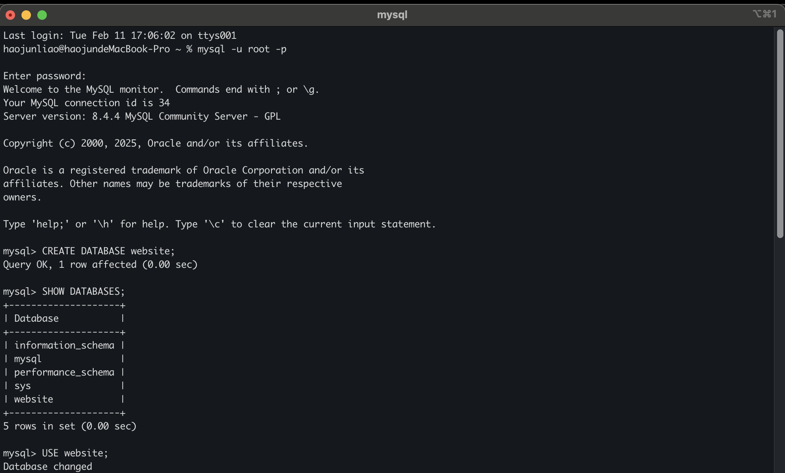

- Create a new table named member, in the website database, designed as below:
```sql
CREATE TABLE member ( -- 建立 member表單
    id BIGINT PRIMARY KEY AUTO_INCREMENT -- 唯一 ID，自動遞增
);
ALTER TABLE member ADD COLUMN name VARCHAR(255) NOT NULL; -- 姓名
ALTER TABLE member ADD COLUMN username VARCHAR(255) NOT NULL; -- 使用者名稱
ALTER TABLE member ADD COLUMN password VARCHAR(255) NOT NULL; -- 密碼
ALTER TABLE member ADD COLUMN follower_count INT UNSIGNED NOT NULL DEFAULT 0; --  追蹤數 預設0，不允許負數
ALTER TABLE member ADD COLUMN time DATETIME NOT NULL DEFAULT CURRENT_TIMESTAMP; -- 註冊時間，預設當前時間
```

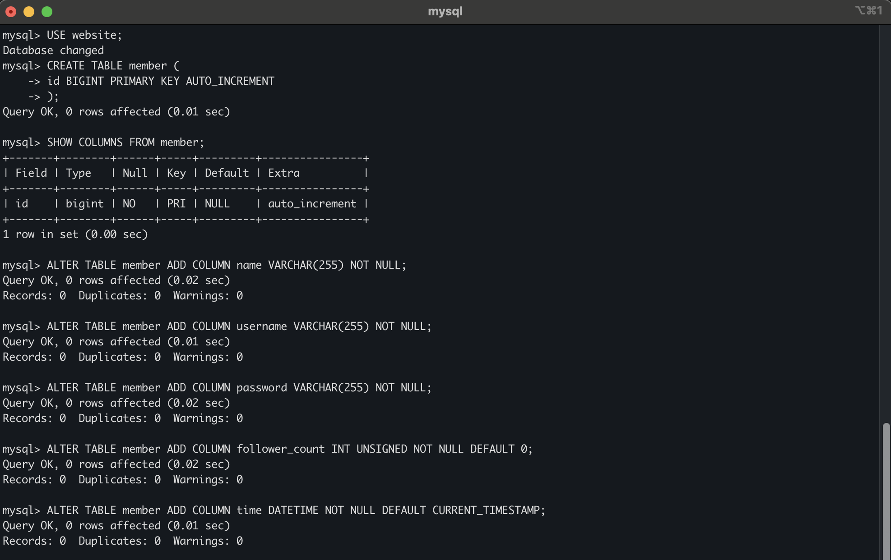

```sql
SHOW TABLES; --顯示 所有表單
```

```sql
SHOW COLUMNS FROM member; --顯示 member 表單
```
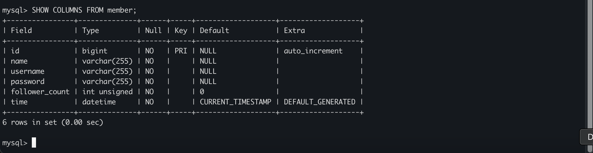
Task 3: SQL CRUD
---
- INSERT a new row to the member table where name, username and password must be set to test. INSERT additional 4 rows with arbitrary data.
```sql
-- 插入一筆新資料 member 到member表，name、username 和 password 設為 test
INSERT INTO member (name, username, password)
VALUES ('test', 'test', 'test');
-- 插入額外 4 筆任意資料
INSERT INTO member (name, username, password)
VALUES
('Apple', 'apple123', 'pass123'),
('Banana', 'banana456', 'yellow'),
('cat', 'cat789', 'mycat789'),
('Dog', 'dog987', 'word999');
```

- SELECT all rows from the member table.
```sql
SELECT * FROM member; -- 查詢 member 表的所有資料
```

- SELECT all rows from the member table, in descending order of time.
```sql
SELECT * FROM member ORDER BY time DESC; -- ORDER BY time DESC 按時間降序排列
```

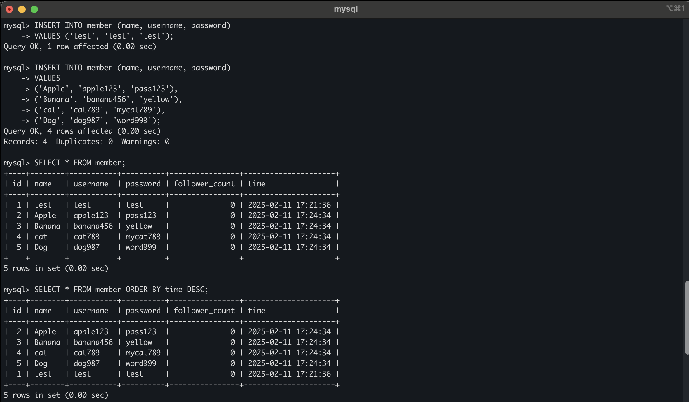
- SELECT total 3 rows, second to fourth, from the member table, in descending order of time. Note: it does not mean SELECT rows where id are 2, 3, or 4.
```sql
SELECT * FROM member ORDER BY time DESC LIMIT 3 OFFSET 1; -- LIMIT 3  取出3筆資料，OFFSET 1 跳過第一筆資料
```

- SELECT rows where username equals to test.
```sql
SELECT * FROM member WHERE username = 'test';
```

- SELECT rows where name includes the es keyword.
```sql
SELECT * FROM member WHERE name LIKE '%es%'; -- LIKE '%es%'模糊查詢
```

- SELECT rows where both username and password equal to test.
```sql
SELECT * FROM member WHERE username = 'test' AND password = 'test';
```
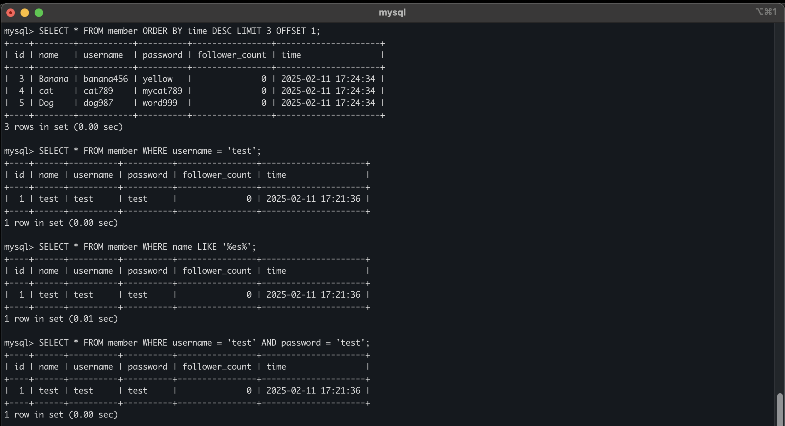

- UPDATE data in name column to test2 where username equals to test.
```sql
UPDATE member
SET name = 'test2'
WHERE username = 'test';
```
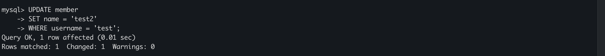
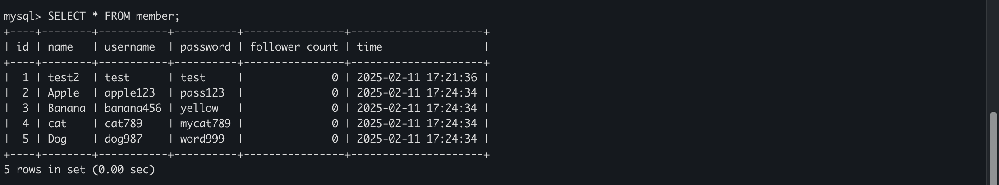
Task 4: SQL Aggregation Functions
---
- SELECT how many rows from the member table.
```sql
SELECT COUNT(*) AS total_rows FROM member; -- COUNT(*) 計算總行數
```
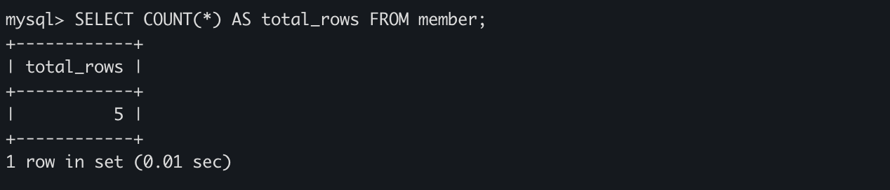

- SELECT the sum of follower count of all the rows from the member table.
```sql
-- 添加粉絲追蹤數
UPDATE member SET follower_count = 35 WHERE username = 'test';
UPDATE member SET follower_count = 10 WHERE username = 'apple123';
UPDATE member SET follower_count = 5 WHERE username = 'banana456';
UPDATE member SET follower_count = 66 WHERE username = 'cat789';
UPDATE member SET follower_count = 50 WHERE username = 'dog987';
```
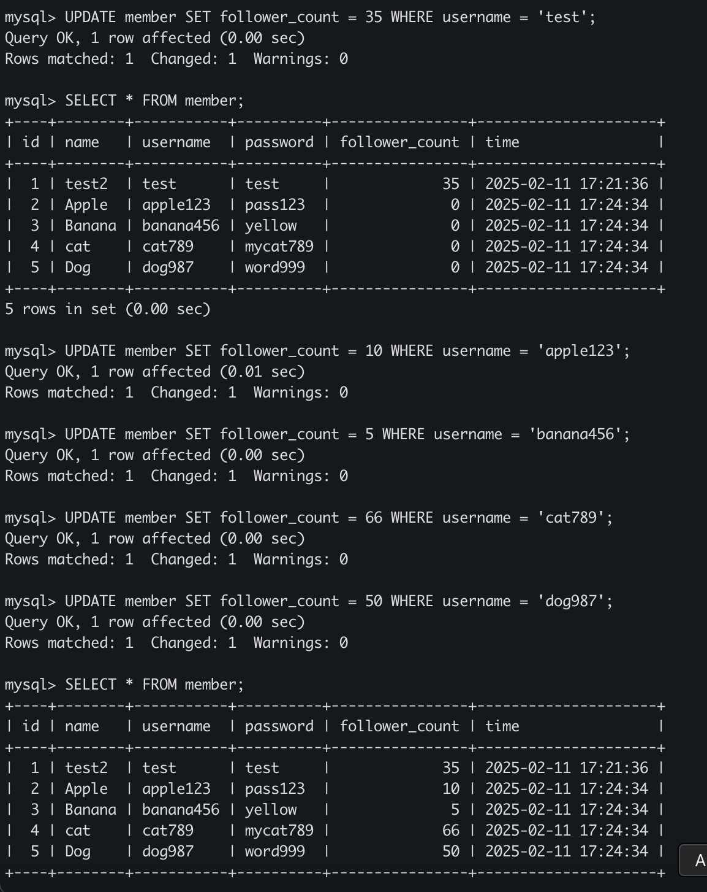

```sql
SELECT SUM(follower_count) AS total_followers FROM member; -- SUM(follower_count)計算所有會員的粉絲數總和
```
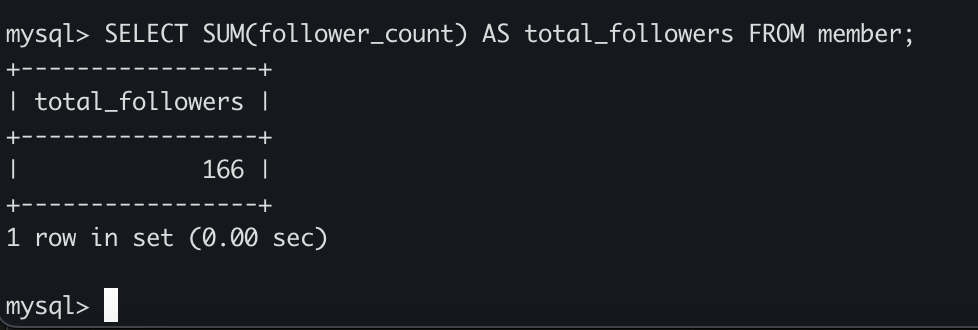

- SELECT the average of follower count of all the rows from the member table.
```sql
SELECT AVG(follower_count) AS avg_followers FROM member; -- AVG(follower_count) 計算所有會員粉絲數的平均值
```
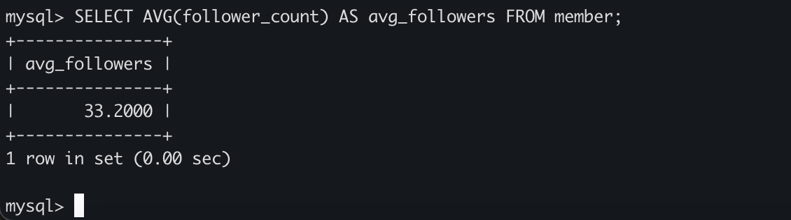

- SELECT the average of follower count of the first 2 rows, in descending order of follower count, from the member table.
```sql
SELECT AVG(follower_count) AS top2_avg_followers
FROM (SELECT follower_count FROM member ORDER BY follower_count DESC LIMIT 2) AS subquery; 
-- ORDER BY follower_count DESC LIMIT 2  先按照粉絲數降序排序，取出前2筆資料
-- AVG(follower_count)  計算這兩筆數據的粉絲數平均值
-- 子查詢 (subquery)讓MySQL先取出前2筆資料，再對它們做AVG計算
```

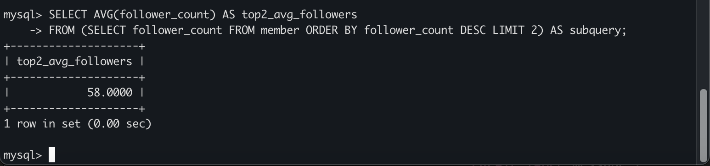

Task 5: SQL JOIN
---
- Create a new table named message, in the website database. designed as below:
```sql
-- 建立 message 表單
CREATE TABLE message (
id BIGINT PRIMARY KEY AUTO_INCREMENT,
member_id BIGINT NOT NULL,
content VARCHAR(255) NOT NULL,
like_count INT UNSIGNED NOT NULL DEFAULT 0,
time DATETIME NOT NULL DEFAULT CURRENT_TIMESTAMP
FOREIGN KEY (member_id) REFERENCES member(id);
); 
```
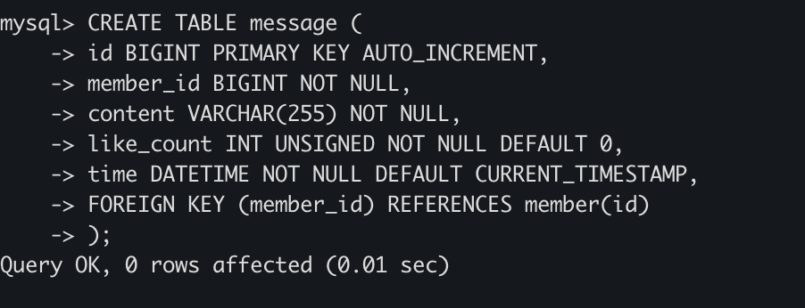
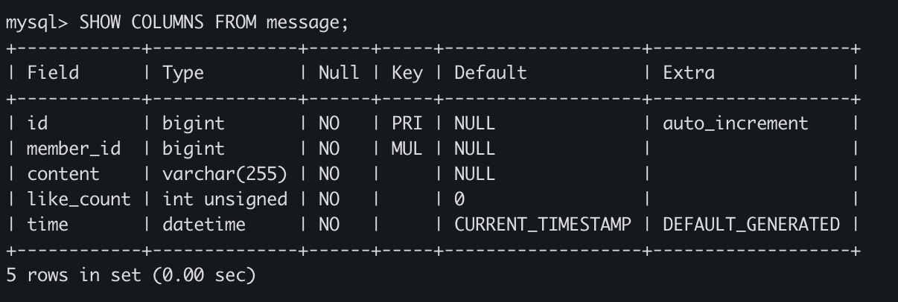

```sql
-- 匯入 從member 表單 中找到對應的 id 跟 username
SELECT id, username FROM member;
```
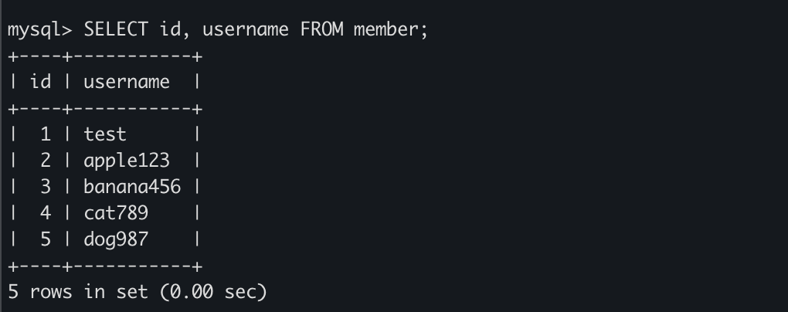

```sql
-- 根據member資料表中的id，插入一些message資料：
INSERT INTO message (member_id, content, like_count)
VALUES
(1, 'Hello, World Test2', 10),
(2, 'this is an apple', 30),
(1, 'Test Test', 5),
(3, 'banana is good', 20),
(5, 'my cat is sick', 88),
(4, 'it is my cat, not your dog',36),
(3, 'banana is yellow',40);
```
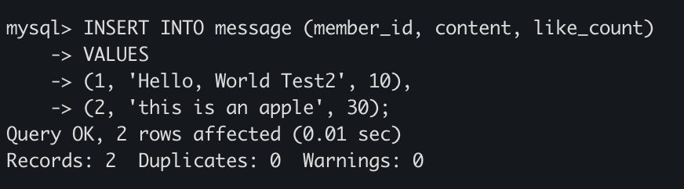
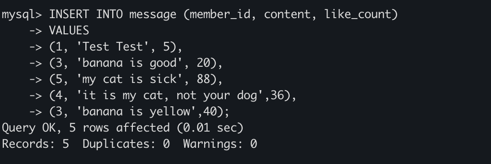

```sql
--查看message的表單資料
SELECT * FROM message;
```
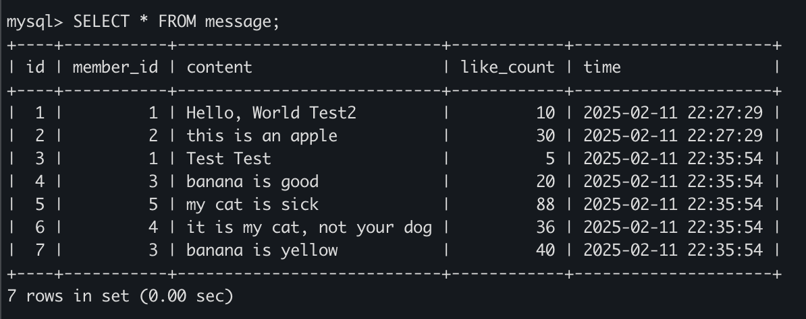

- SELECT all messages, including sender names. We have to JOIN the member table to get that.
```sql
-- 查詢所有留言，包括發送者的姓名
SELECT message.id, member.name, message.content, message.like_count, message.time
FROM message
JOIN member ON message.member_id = member.id;
```
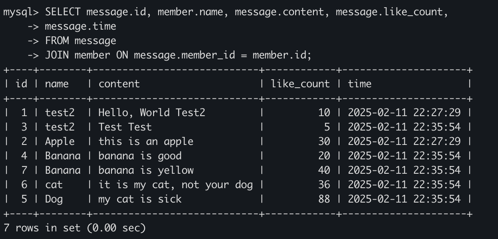

- SELECT all messages, including sender names, where sender username equals to test. We have to JOIN the member table to filter and get that.
```sql
-- 查詢username為test的留言
SELECT message.id, member.name AS sender_name, message.content, message.like_count, message.time
FROM message
JOIN member ON message.member_id = member.id
WHERE member.username = 'test';
```
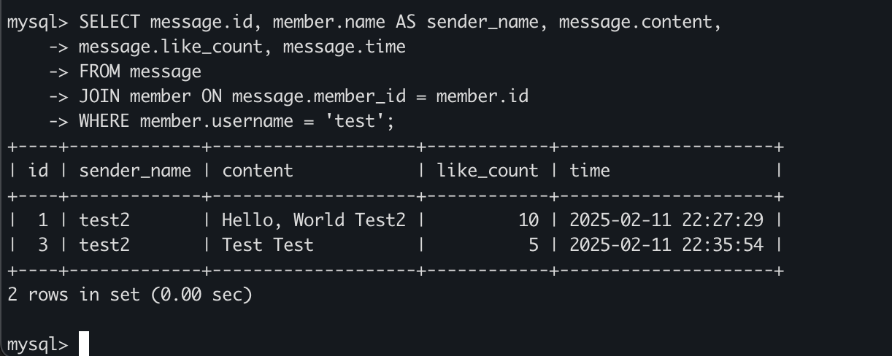

- Use SELECT, SQL Aggregation Functions with JOIN statement, get the average like count of messages where sender username equals to test.
```sql
-- 計算username為test的留言平均按讚數
SELECT AVG(message.like_count) AS avg_likes
FROM message
JOIN member ON message.member_id = member.id
WHERE member.username = 'test';
```
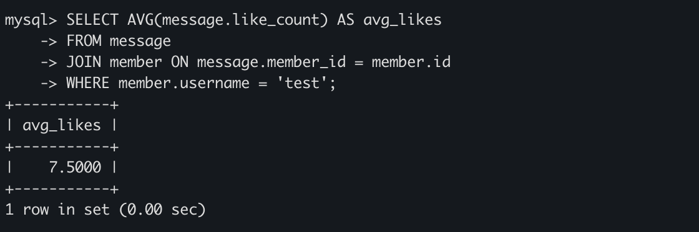

- Use SELECT, SQL Aggregation Functions with JOIN statement, get the average like count of messages GROUP BY sender username.
```sql
-- 計算每位發送者的留言平均按讚數
SELECT member.username, AVG(message.like_count) AS avg_likes
FROM message
JOIN member ON message.member_id = member.id
GROUP BY member.username;
```
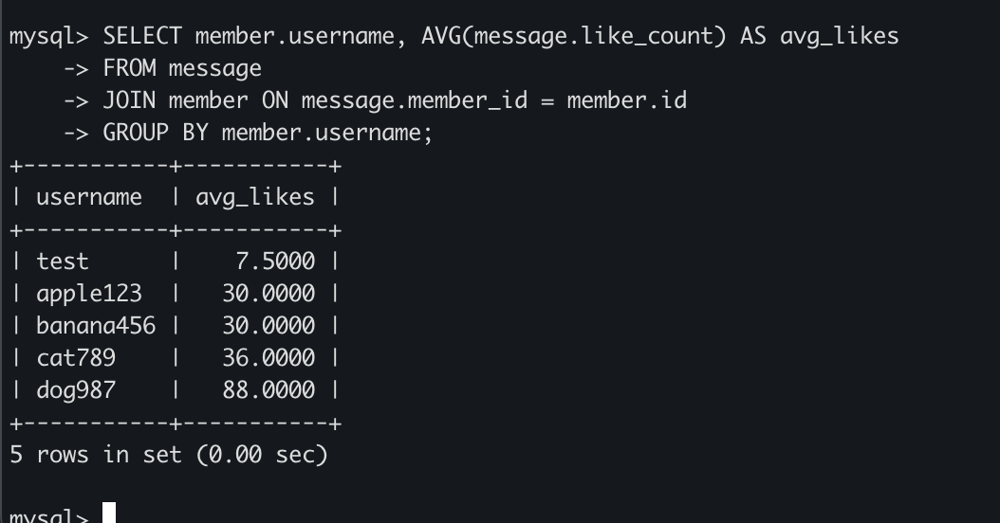

-  匯出 website 資料庫成data.sql
```-zsh
mysqldump -u root -p website > data.sql
```
